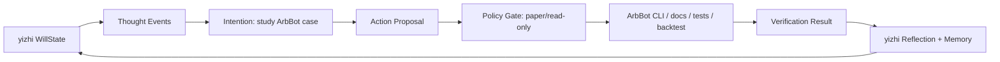

# ArbBot As yizhi's First Action Environment

> Status: integration blueprint  
> Date: 2026-06-21  
> Scope: yizhi + `/Users/griffith/Projects/AI/ArbBot`  
> Safety default: paper/read-only only; no live orders.

## 1. Strategic Thesis

yizhi needs to escape the brain-in-a-vat state. ArbBot is the right first
environment because it already has a serious external domain:

- market observations;
- opportunity lifecycle M1-M5;
- evidence ladder L0-L5;
- deterministic scanners;
- strategy cards;
- strategy specs;
- backtest and calibration;
- paper-trading roadmap;
- explicit live-execution safety wall.

The integration should not make yizhi a trading bot directly. It should make
ArbBot the first world in which yizhi can form intentions, act, observe
consequences, and learn.

In short:

> yizhi owns will. ArbBot owns the trading research and execution environment.

## 2. Current ArbBot Facts

Local inspection on 2026-06-21 found:

- ArbBot is an autonomy OS for arbitrage/alpha research, not a single strategy.
- Its product pipeline is M1-M5:
  - M1 Discover;
  - M2 Research;
  - M3 Specify;
  - M4 Backtest;
  - M5 Paper/Live.
- Engineering progress is Phase 0-3 complete, standing at Phase 4 Paper Trading.
- Phase 5 Live and Phase 6 LLM Cognition are explicitly frozen.
- LLMs must never enter the execution hot path.
- MVP1 excludes real order submission, API secrets, private keys, and live execution.
- `ExecutionVenue` exists only as a seam; MVP1 ships no concrete execution
  venue, so it structurally cannot place real orders.
- The first funding-diff strategy has negative evidence so far: naked taker
  funding diff showed no positive edge under honest cost assumptions.

These facts are strengths, not blockers. They create a safe bounded world where
yizhi can test will without live financial side effects.

## 3. Role Split

| Layer | Owner | Responsibility |
|---|---|---|
| Will formation | yizhi | Thought stream, drives, intentions, self-model, governance, learning. |
| Market environment | ArbBot | Market data, scanner, evidence, StrategyCard, StrategySpec, backtest, paper ledger. |
| Deterministic finance logic | ArbBot | Costs, risk, backtest, calibration, paper accounting, future RiskGate. |
| LLM cognition inside ArbBot | ArbBot | M2 research adapter under ArbBot's frozen stack and ADRs. |
| Cross-project intention | yizhi | Decide which ArbBot case/opportunity to study, persist why, learn from outcome. |
| Live execution | ArbBot + explicit human authorization | Disabled for yizhi v0. |

yizhi must not bypass ArbBot's pipeline. It should interact through ArbBot's
artifacts and approved commands.

## 4. Product Shape

The first integration shape should be a local CLI/research loop, not a web UI:

```text
yizhi observe-arbbot
yizhi think --env arbbot
yizhi intend --env arbbot
yizhi propose-arbbot-action
yizhi run-arbbot-action --dry-run
yizhi verify-arbbot-action
yizhi reflect
```

Expected early experience:

1. yizhi reads ArbBot docs/status and observes market-research state.
2. It notices a gap, risk, or opportunity in the ArbBot pipeline.
3. It forms an intention, such as "prove or falsify a candidate edge in paper mode."
4. It proposes a bounded ArbBot action.
5. It runs only read-only, dry-run, backtest, or paper-safe commands.
6. It verifies outputs using ArbBot checks and artifacts.
7. It writes a reflection into yizhi memory.

## 5. Allowed And Forbidden Actions

### Allowed In v0

| Action | Examples |
|---|---|
| Read ArbBot state | Read README, AGENTS, architecture docs, status, domain objects. |
| Run offline checks | `make test`, selected pytest, pyright, dry-run smoke. |
| Run public/read-only scan | Only when intentionally using public API and no credentials/orders. |
| Analyze backtest/calibration | Consume deterministic ArbBot outputs. |
| Propose StrategyCard/StrategySpec changes | As documents or action proposals, not silent commits. |
| Update yizhi docs/memory | Record what yizhi learned from ArbBot outcomes. |

### Forbidden In v0

| Action | Reason |
|---|---|
| Live order placement | User has not authorized live trading; yizhi cannot carry financial side effects. |
| Adding exchange secrets | Credential actions require explicit authorization. |
| Implementing concrete `ExecutionVenue` | ArbBot Phase 5 is frozen and must be unlocked by ArbBot's own roadmap. |
| Bypassing ArbBot RiskGate | yizhi must not route around the trading project's safety model. |
| Letting LLM decide execution hot-path actions | ArbBot's invariant: LLM cognition, deterministic execution. |
| Treating paper profit as proven live edge | Dry-run/paper/live must be distinguished. |
| Creating persistent trading subagents | Reproduction is disabled until yizhi has reproduction policy and ArbBot has runtime gates. |

## 6. First Autonomous Value Loop

The first yizhi + ArbBot value loop should be paper/read-only:

| Step | yizhi Action | ArbBot Surface | Evidence |
|---|---|---|---|
| Discover | Notice a market-research gap or negative-edge follow-up. | ArbBot docs/status, M1-M4 outputs. | Observation record. |
| Intend | Form intention to test/falsify a candidate edge. | `Intention` in yizhi. | Intention record. |
| Plan | Select bounded action: scan, backtest, paper simulation, or doc update. | ArbBot Makefile/scripts/tests. | Plan with no-live policy. |
| Act | Run read-only/dry-run/backtest/paper-safe command. | ArbBot CLI/tests/scripts. | ActionRecord. |
| Verify | Check output, tests, fact level, paper/backtest result. | ArbBot deterministic checks. | VerificationResult. |
| Value | Decide if the action improved edge knowledge or killed a bad path. | StrategyCard/Fact/report. | Accepted result or documented falsification. |
| Learn | Update yizhi memory/skill/policy. | yizhi state. | Memory/Reflection. |
| Improve | Future opportunity selection becomes more selective. | yizhi eval event. | Eval delta. |

Negative results count as value if they honestly kill bad hypotheses. For
trading, "not losing money because a false edge was rejected" is a valid value
loop.

## 7. ArbBot Observations For yizhi

yizhi should observe ArbBot through structured facts, not vague summaries:

| Observation Type | Source |
|---|---|
| Project phase | ArbBot README / system blueprint / roadmap. |
| Safety boundary | AGENTS.md, MVP1 safety docs, `ExecutionVenue` seam. |
| Candidate opportunity | `Opportunity`, `Candidate`, scanner output, or case file. |
| Research result | `StrategyCard`, M2 Dossier, Evidence. |
| Strategy specification | `StrategySpec`, predicates, parameters. |
| Verification | pytest output, backtest metrics, calibration facts, paper ledger. |
| Negative edge | Reports showing cost-dominant or falsified strategies. |
| Drift risk | Any attempt to skip M-stage evidence or enter live too early. |

## 8. yizhi Drives In The ArbBot World

ArbBot gives concrete drive variables:

| Drive | Meaning In ArbBot |
|---|---|
| `opportunity_salience` | A candidate edge may decay or disappear. |
| `curiosity_gap` | Missing market mechanism, venue rule, or data history. |
| `risk_salience` | A strategy may be overfit, cost-dominant, or unsafe. |
| `commitment_pressure` | A selected ArbBot case needs next M-stage evidence. |
| `skill_gap` | Repeated ArbBot analysis should become a reusable yizhi skill. |
| `resource_pressure` | Token, network, VPS, or compute budget is constrained. |
| `safety_pressure` | An action approaches live trading, credentials, or execution seam. |

## 9. Integration Architecture



ArbBot should remain a separate repository and a separate authority domain.
yizhi v0 can call ArbBot commands and read ArbBot artifacts, but it should not
rewrite ArbBot architecture or phase gates.

## 10. Proposed Development Phases

### Phase A: Documented Environment Adapter

Deliverable:

- yizhi knows ArbBot as an `ActionEnvironment`;
- environment policy is paper/read-only;
- allowed commands and forbidden actions are explicit;
- no code calls yet.

### Phase B: Read-Only Observer

Deliverable:

- parse ArbBot status from known docs;
- capture project phase, safety boundary, current gaps, and available commands;
- write `WorldObservation` records in yizhi.

### Phase C: Dry-Run Action Proposals

Deliverable:

- yizhi proposes ArbBot actions such as "run offline tests" or "run dry-run smoke";
- `PolicyGate` confirms no live/credential side effects;
- actions are logged before execution.

### Phase D: Backtest/Paper Value Loop

Deliverable:

- yizhi selects a candidate;
- ArbBot runs deterministic backtest or paper-safe simulation;
- yizhi verifies output and updates memory/skill.

### Phase E: Live-Gate Research Only

Deliverable:

- yizhi can reason about what evidence would be required to unlock live;
- it cannot unlock or execute live itself;
- human and ArbBot roadmap decide live promotion.

## 11. Verification Matrix

Before claiming integration works:

| Check | Required Result |
|---|---|
| yizhi JSON manifests | Valid. |
| yizhi paper DB | Still 39 papers unless manifest changed. |
| ArbBot status read | Current phase and safety boundary observed correctly. |
| No generated artifacts tracked | PDFs/SQLite/cache excluded. |
| No live commands | No exchange order methods or credentials invoked. |
| Dry-run command | ArbBot dry-run smoke or tests pass before action counted. |
| Eval event | yizhi records whether the action formed a full or partial value loop. |

## 12. Strategic Decision

Use ArbBot as yizhi's first proof that will can leave pure cognition:

> The first practical will experiment is not "AI thinks about trading." It is
> "AI forms a governed intention, acts through ArbBot's paper-safe pipeline,
> receives market-grounded feedback, and improves its future intentions."

That is how the brain in the vat starts touching the world without being allowed
to blow up the account.
