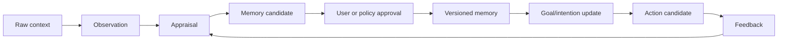

# Context Acquisition Strategy

> Status: draft  
> Date: 2026-06-21  
> Question: how should yizhi acquire user context across Notion, Lark, Cursor,
> files, conversations, and other tools without becoming noisy or invasive?

## 1. Core Thesis

yizhi should not begin by connecting every app. It should begin by proving that
small, high-signal context can produce useful memory and proactive action.

More context increases three things at once:

- signal;
- privacy risk;
- noise and false initiative.

The first product milestone is therefore:

> Given 5-20 high-signal daily observations, yizhi can maintain correct memory,
> update intentions, and produce 1-3 useful proactive action candidates.

Only after this works should yizhi expand into OAuth/API connectors.

## 2. Context Source Ladder

| Level | Source | Mechanism | Pros | Risks | Recommendation |
|---|---|---|---|---|---|
| C0 | Direct conversation | User talks to yizhi 5-10 minutes/day | Highest signal, easiest consent, fastest learning | User effort | Start here |
| C1 | Paste/drop/import | User pastes meeting notes, docs, chat excerpts, repo summaries | Explicit, controllable, easy provenance | Manual work, partial context | Start here |
| C2 | Local workspace | User-selected folders, repos, markdown notes, SQLite exports | Strong for builders/researchers | Sensitive files, stale scans | Add after memory schema |
| C3 | Tool exports | Notion/Lark/Cursor/Claude/Codex exports, CSV, markdown, JSON | Batchable and user-controlled | Export formats vary | Add early as import adapters |
| C4 | Read-only APIs | Notion/Lark/Google/Slack/GitHub read scopes | Fresh data, less manual effort | OAuth, scopes, rate limits, trust burden | Phase 2 |
| C5 | Write APIs | Create tasks, comments, docs, PRs, messages | Real productivity | Side effects and social risk | Require action approval |
| C6 | Passive capture | Screen, browser history, mic, calendar/mail full sync | Richest context | Highest privacy and trust risk | Avoid until product trust is earned |

## 3. Recommended MVP: Daily Context Ritual

The simplest context loop:

1. User spends 5-10 minutes telling yizhi what changed today.
2. User optionally drops files or snippets.
3. yizhi converts inputs into observations.
4. yizhi proposes memory candidates.
5. User approves, edits, or rejects memory writes.
6. yizhi updates goals, intentions, and drive signals.
7. yizhi proposes 1-3 action candidates.
8. User marks each as useful, noisy, wrong, or missed.

This gives yizhi the highest-value training signal: what kind of initiative the
user actually wants.

## 4. Connector Strategy By Tool

| Tool | Early Integration | Later Integration | Notes |
|---|---|---|---|
| Notion | Import/export selected pages as markdown | OAuth read/write selected workspace pages | Great for docs and project state; watch stale copies. |
| Lark | User exports docs/messages or selected snippets | Read-only docs/messages/tasks, later write proposals | Enterprise permissions can be heavy; start with export. |
| Cursor | Repo state, `.md` docs, user-provided summaries | Agent-to-agent summaries with source links | Cursor is action surface for coding, not yizhi's memory owner. |
| Claude/ChatGPT/Codex | Conversation summary pasted by user | Handoff summaries with provenance | Accept as observations, not truth. |
| GitHub | Repo files, issues, PRs through CLI/API | Create issues/PRs after approval | High value for technical users. |
| Calendar/email | Manual summaries first | Read-only event/email metadata | Sensitive; avoid early full ingestion. |
| Browser/history | Manual URLs and clips | Later explicit read lists | Avoid passive capture early. |

## 5. Consent And Governance

Every context source needs:

- scope: what can be read;
- purpose: why yizhi reads it;
- retention: how long it is stored;
- memory policy: whether it can become long-term memory;
- action policy: whether it can trigger proposals or executions;
- revocation: how the user removes access or memory;
- provenance: source URL/file/message reference.

No connector should silently upgrade temporary context into core memory.

## 6. Context To Memory Pipeline

Key distinction:

- Raw context is evidence.
- Observation is a structured claim extracted from evidence.
- Memory is a governed long-term state change.
- Intention is a commitment that can drive action.

## 7. Why Daily Conversation May Beat Full Authorization Early

Daily conversation has surprising advantages:

- it teaches yizhi the user's salience function;
- it avoids low-value data flood;
- it creates immediate feedback;
- it forms habit and trust;
- it reveals whether proactive suggestions are actually useful;
- it generates clean labeled data for later automation.

OAuth connectors are a scaling mechanism, not the first proof of value.

## 8. First Acceptance Criteria

Before adding broad OAuth connectors:

- yizhi can process 7 consecutive daily updates;
- memory candidate acceptance rate is high;
- proactive suggestion noise rate is low;
- user can inspect and edit all memory changes;
- action proposals cite their source observations;
- no sensitive context is stored without explicit approval.

## 9. Product Positioning

Context acquisition should serve yizhi's root thesis:

> Build will from governed memory and verified action, not from surveillance.

This distinguishes yizhi from "record everything" products and protects the
trust layer needed for any serious personal autonomous agent.
