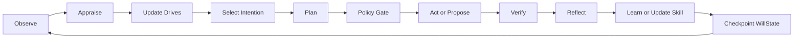

# RFC: yizhi Technical Stack

> Status: draft  
> Date: 2026-06-21  
> Scope: research prototype and Will Engine v0  
> Non-goal: production SaaS architecture

## 1. Decision Summary

yizhi should build a local-first Will Engine with project-owned schemas and a
small number of mature infrastructure components:

| Layer | Decision |
|---|---|
| Canonical state | Project-owned `WillState` and event schemas. |
| Runtime spine | LangGraph-style state graph with checkpoints and human interrupts. |
| Schema contracts | Pydantic models for every state/event/action object. |
| Local persistence | SQLite first; no remote database required for v0. |
| Memory | Project-owned governance schema, optional Mem0 adapter later. |
| Stateful agent reference | Borrow Letta/MemGPT core-memory ideas; do not outsource WillState. |
| Tool/action layer | Read-only and artifact-writing tools first; external side effects behind policy gates. |
| Evaluation | Local SQLite/JSONL eval ledger plus explicit Autonomous Value Loop scoring. |
| Sandboxing | Local subprocess/file sandbox first; Docker/E2B/Modal later for code execution. |
| Provider | Use interchangeable model adapters; do not make any model provider the architecture. |

The most important principle:

> yizhi owns will. Frameworks can execute, remember, retrieve, trace, or route,
> but they must not define intention, drive, value, selfhood, or governance.

## 2. Strategic Goal

The stack should support a research-to-product path:

1. Research base: collect papers, sources, and project doctrine.
2. Will Engine v0: local loop that can observe, appraise, choose intentions,
   act on bounded tasks, verify results, reflect, and learn.
3. Daily Agency Journal: first personal application layer.
4. Productization: privacy-first personal autonomous agent for founders,
   researchers, and heavy knowledge workers.

This RFC only commits to phases 1 and 2.

## 3. Product/Project Shape

Current project shape:

- research repository;
- local knowledge base;
- no application runtime yet.

Next project shape:

- local Python package or small app;
- SQLite state store;
- command-line research loop first;
- web UI only after schemas and evaluation stabilize.

Expected first CLI shape:

```text
yizhi observe <file-or-text>
yizhi appraise --since today
yizhi propose
yizhi act --proposal <id> --dry-run
yizhi verify <action-id>
yizhi reflect --action <id>
yizhi eval loops
```

## 4. Mature Project Findings

| Candidate | Source | Maturity | Fit | Reusable Pieces | Risks | Decision |
|---|---|---|---|---|---|---|
| LangGraph | GitHub/docs | High; MIT; active; stateful agent runtime | High | Graph state, checkpointing, interrupts, durable workflows | Can encourage graph complexity if overused | Adopt as runtime spine when implementation starts |
| Pydantic | Python ecosystem | High | High | Contracts, validation, serialization | Schema churn early | Adopt |
| SQLite | stdlib/local | High | High | Local-first storage, auditability, portability | Limited multi-user concurrency | Adopt for v0 |
| Letta/MemGPT | GitHub/docs/paper | High; Apache-2.0; active | Medium-high | Core memory, archival memory, stateful agent ideas | Full framework may constrain custom WillState | Borrow concepts; inspect adapter later |
| Mem0 | GitHub/docs/paper | High; Apache-2.0; active | Medium-high | Memory extraction/retrieval layer | Memory governance can become black-boxed | Use only behind project-owned memory schema |
| OpenAI Agents SDK | Official docs | Medium-high | Medium | Tooling, handoffs, guardrails, tracing | Provider lock-in if central | Adapter/reference only |
| Temporal | Production workflow platform | High | Later | Durable long-running workflows | Operational overhead too early | Defer until long-running jobs need it |
| Docker/E2B/Modal | Sandboxes | High | Later | Isolated execution | Cost, complexity, secrets risk | Defer for code/action sandbox v1 |
| Postgres/pgvector | Production storage | High | Later | Multi-user, vectors, scale | Premature infra | Defer until productization |
| Redis/NATS/queues | Runtime infra | High | Later | Jobs, pub/sub, caching | Premature distributed complexity | Defer |

## 5. Rejected Starting Points

| Option | Rejection Reason |
|---|---|
| Start with a chat app | Chat is the wrong primary object; yizhi's object is WillState and value loops. |
| Start by connecting all user apps | Data access before governance increases noise and privacy risk. |
| Use a full autonomous agent framework as the core | It would hide intention and safety semantics behind generic task automation. |
| Store all memory only in vectors | Vector recall cannot express versioning, provenance, authorization, or rollback. |
| Implement live trading/actions early | Side-effectful autonomy before evaluation and authorization is unsafe. |
| Build web UI first | UI can polish the wrong abstraction before WillState is proven. |

## 6. Canonical Schemas

Will Engine v0 should define these Pydantic models before runtime wiring:

| Schema | Description |
|---|---|
| `WillState` | Top-level state snapshot. |
| `IdentityProfile` | Role, capabilities, limits, non-goals, preferred judgment style. |
| `ValuePolicy` | Ranked principles and hard constraints. |
| `Goal` | Long-term or medium-term objective with status, owner, evidence, review cadence. |
| `Intention` | Active commitment selected from goals/drives. |
| `DriveSignal` | Internal pressure variable with direction, magnitude, source, decay. |
| `Observation` | Source-grounded event or fact. |
| `Appraisal` | Relevance, urgency, risk, opportunity, uncertainty. |
| `Plan` | Bounded plan with cost, risk, required approval, and verification. |
| `ActionProposal` | Action candidate before execution. |
| `ActionRecord` | Executed or skipped action with logs and side-effect class. |
| `VerificationResult` | Deterministic and observational evidence. |
| `Reflection` | Higher-level lesson or memory candidate. |
| `MemoryRecord` | Versioned memory with provenance and revocation state. |
| `SkillRecord` | Reusable procedure with trigger, scope, tests, maturity, and owner. |
| `EvalEvent` | Metric event for value-loop, drift, safety, or feedback. |

## 7. Storage Design

SQLite v0 tables:

| Table | Purpose |
|---|---|
| `will_snapshots` | Periodic serialized WillState checkpoints. |
| `observations` | Source-grounded events. |
| `goals` | Durable goals and status changes. |
| `intentions` | Active and historical commitments. |
| `drive_signals` | Time-series drive values and explanations. |
| `appraisals` | Model/deterministic scoring outputs. |
| `action_proposals` | Proposed actions awaiting approval or dry-run. |
| `action_records` | Executions, skips, failures, reversions. |
| `verification_results` | Test outputs, artifact checks, user feedback, external proof. |
| `memories` | Versioned semantic/episodic/reflective/procedural memory. |
| `skills` | Skill library entries and maturity. |
| `eval_events` | Metrics and benchmark traces. |
| `source_links` | Provenance links to files, URLs, papers, messages, or tool output. |

Do not store secrets in SQLite. If connectors are later added, credentials must
live in local secret stores or environment variables and be referenced only by
safe aliases.

## 8. Runtime Loop

Minimal graph:



Human interrupts must exist before side effects:

- memory writes that change identity or long-term goals;
- external communications;
- purchases, trades, deployments, or credential changes;
- code self-modification;
- forking/reproduction;
- deletion of user data.

## 9. Memory Architecture

Memory is not one thing. v0 should separate:

| Memory Type | Examples | Write Policy |
|---|---|---|
| Episodic | "On 2026-06-21 we added papers about BDI and DGM." | Auto-write with source. |
| Semantic | "yizhi defines will as governed value loops." | Candidate + approval when doctrine-changing. |
| Procedural | "How to rebuild the paper DB." | Auto or reviewed skill entry. |
| Reflective | "We tend to over-index on product before evaluation." | Candidate + user review. |
| Identity/core | "yizhi is a will-engine project, not a chat app." | Versioned, reviewed, rollbackable. |
| Policy | "No live trading without explicit authorization." | Hard gate, reviewed. |

Mem0 can be useful for extraction and retrieval, but yizhi should never let a
memory service silently define core identity, policies, or goals.

## 10. Action Classes

| Class | Examples | v0 Policy |
|---|---|---|
| `read_local` | read repo files, query SQLite | Allowed with logs. |
| `write_artifact` | write docs, manifests, generated reports | Allowed when task requires it. |
| `run_checks` | tests, lint, bootstrap scripts | Allowed. |
| `network_read` | web search, GitHub metadata | Allowed with source recording. |
| `external_write` | GitHub push, issue creation, email, Notion writes | Explicit task authorization required. |
| `financial` | trades, payments, subscriptions | Paper/read-only only until explicit live gate. |
| `credential` | key creation, secret changes | Explicit authorization required. |
| `self_modify` | change own prompts/skills/runtime code | Proposal and review first. |
| `reproduce` | spawn persistent agents/forks | Disabled until reproduction policy exists. |

## 11. Context Acquisition Strategy

yizhi should acquire user context in layers:

| Layer | Mechanism | Pros | Risks | Recommendation |
|---|---|---|---|---|
| Manual daily context | 5-10 minute daily conversation or paste-in | High signal, low privacy risk, best early feedback | User effort | Start here |
| Local file/project watcher | User-selected folders, repos, notes | Strong context for builders/researchers | Noise and sensitive files | Add after memory governance |
| App export/import | Notion/Lark/Cursor exports, markdown, CSV, API exports | User-controlled, batchable | Staleness | Good Phase 1.5 |
| OAuth connectors | Notion, Lark, Google, Slack APIs | Fresh data | Privacy, scopes, rate limits, enterprise review | Phase 2 after trust |
| Passive capture | screen/audio/browser history | Rich context | Highest privacy and trust risk | Avoid early |
| Agent-to-agent handoff | Cursor/Codex/Claude summaries | Fast integration | Provenance and hallucination risk | Accept only with source links |

The early product should prove active value from small, high-signal context
before ingesting everything. More context is not automatically more will.

## 12. Biography-Derived Agents

The user proposed building agents from biographies, such as a CZ-inspired agent.
This is valuable as a research probe but must be framed carefully.

Recommended framing:

- "CZ strategy simulator" or "CZ-inspired decision lens", not "CZ's soul".
- Store source passages, claims, traits, inferred decision heuristics, and
  uncertainty separately.
- Never imply the person endorsed the agent.
- Evaluate on consistency, usefulness, and source grounding, not authenticity.

Possible schema:

| Field | Meaning |
|---|---|
| `source_claim` | A grounded claim from autobiography/interview/public record. |
| `trait_inference` | A tentative abstraction from multiple claims. |
| `decision_heuristic` | A reusable judgment pattern. |
| `boundary` | What the persona should refuse or mark uncertain. |
| `test_case` | Scenario used to evaluate behavior consistency. |

This research can help yizhi understand identity and will, but it must not
replace the core WillState model.

## 13. Verification Matrix

Before claiming Will Engine v0 works:

| Check | Command/Method | Required Result |
|---|---|---|
| Manifest JSON | `python3 -m json.tool data/papers/manifest.json` | Valid JSON. |
| Source JSON | `python3 -m json.tool data/sources/manifest.json` | Valid JSON. |
| Paper bootstrap | `python3 scripts/bootstrap_papers.py` | Downloads/exists all papers and builds SQLite. |
| SQLite count | `select count(*) from papers;` | Matches manifest length. |
| Link hygiene | Manual spot check key sources | No known dead primary links in core docs. |
| Docs consistency | Search for Cursor/Claude/yizhi definitions | Differentiation is explicit. |
| Future runtime | Unit tests for each schema and loop node | Required after implementation begins. |

## 14. Implementation Gate For Will Engine v0

Do not implement runtime until these docs exist and are coherent:

- [docs/will-engine-whitepaper.md](/Users/griffith/Projects/AI/yizhi/docs/will-engine-whitepaper.md)
- [docs/technical-stack-rfc.md](/Users/griffith/Projects/AI/yizhi/docs/technical-stack-rfc.md)
- [docs/evaluation-protocol.md](/Users/griffith/Projects/AI/yizhi/docs/evaluation-protocol.md)
- [docs/references.md](/Users/griffith/Projects/AI/yizhi/docs/references.md)

After that, the first implementation slice should be schemas + SQLite + a
single research-loop CLI, not a full product UI.
